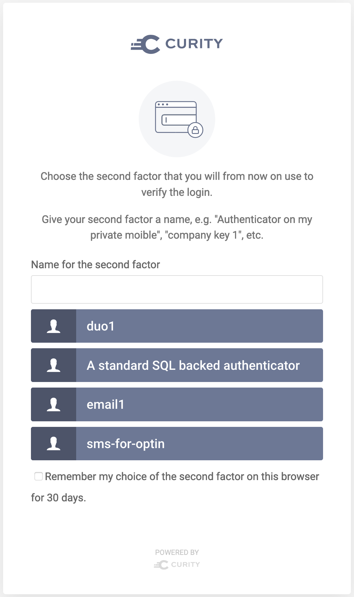

OptInMFA Authentication Action Plugin
=============================================

.. image:: https://img.shields.io/badge/quality-demo-red
    :target: https://curity.io/resources/code-examples/status/

.. image:: https://img.shields.io/badge/availability-source-blue
    :target: https://curity.io/resources/code-examples/status/

An authentication action plugin for the Curity Identity Server. The Action allows your users to choose second factor
authentication based on a list of authenticators configured in the plugin. For example, you can allow your users to choose
an email, sms, bank ID or Duo authenticator as a second factor. The user can choose which one they will want to use, register
a device (if needed) and then use the chosen second factor in any subsequent logins.

Building the Plugin
~~~~~~~~~~~~~~~~~~~

Build the plugin by issuing the command ``mvn package``. This will produce a few JAR file in the ``target`` directory,
which can be installed to your instance of the Curity Identity Server.

Installing the Plugin
~~~~~~~~~~~~~~~~~~~~~

To install the plugin, copy the compiled JAR (and all of its dependencies) into the :file:`${IDSVR_HOME}/usr/share/plugins/${pluginGroup}`
on each node, including the admin node. For more information about installing plugins, refer to the `curity.io/plugins`_.

Required Dependencies
"""""""""""""""""""""

For a list of the dependencies and their versions, run ``mvn dependency:list``. Ensure that all of these are installed in
the plugin group; otherwise, they will not be accessible to this plug-in and run-time errors will result.

Configuring the plugin
~~~~~~~~~~~~~~~~~~~~~~

Once installed, the action can be added to any authenticator in the Curity Identity Server. There are some configuration
options that you can set for the plugin:

- Account Manager - the manager where the information about second factors and recovery codes should be kept.
- Available Authenticators - a list of authenticators' ACRs from which a user can choose to register their second factor.
  This list should not include SMS or Email authenticators. They are treated specially in the action and should be
  configured separately in the other fields.
- Email Authenticator ACR - the ACR of an email authenticator, if email should be allowed as a second factor.
- SMS Authenticator ACR - the ACR of an SMS authenticator, if SMS should be allowed as a second factor.
- Remember My Choice Days Limit - for how long should the cookie be kept if the user checks the option "Remember my choice".

The flow
~~~~~~~~

First login
"""""""""""

When the user first logs in to the system they are presented with a list of possible second factors:

If the user chooses an authenticator which requires device registration (e.g. Duo or Bank ID) they will be redirected to
the registration page. Once the registration is complete, the user will be presented with a list of recovery codes. These
codes will be needed to regain access to the account should the user lose access to their second factor. After acknowledging
the recovery codes, the user is redirected to the beginning of the action flow so they can confirm login with the second factor.

Subsequent logins
"""""""""""""""""

Once the user has any registered second factors, they are presented with a list of their factors they can choose from. If
the user checks "remember my choice" option the chosen authenticator will be picked automatically for as long as the cookie
lives (the default amount of 30 days can be changed in configuration).

The user can also choose to add or remove a factor or to use the recovery codes to register another factor.

To add another factor or remove a factor, the user will have to log in with another second factor they already have registered.
The user will not get any new recovery codes after registering another factor.

When a recovery code is used to add another factor, then the action does not require the user to confirm login with an
already registered second factor. A recovery code is one use only. Once the user uses all of their codes they are presented
with a new list of codes.

SSO support
"""""""""""

SSO sessions are supported by the plugin. When the user logs in, the action checks whether they have an active SSO session
with any ACR that the user has registered as their second factor. If such an SSO session is found, the user is automatically
logged in.

More Information
~~~~~~~~~~~~~~~~

Please visit `curity.io`_ for more information about the Curity Identity Server.

.. _curity.io/plugins: https://support.curity.io/docs/latest/developer-guide/plugins/index.html#plugin-installation
.. _curity.io: https://curity.io/
